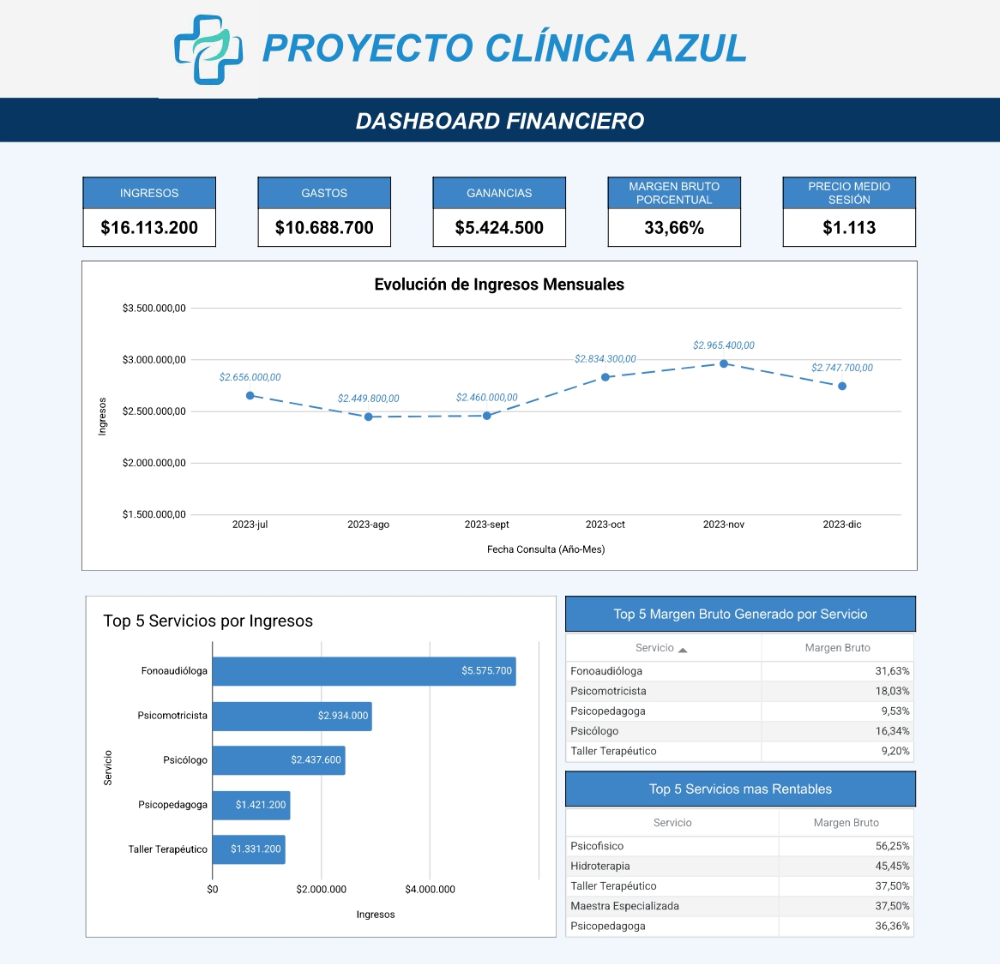
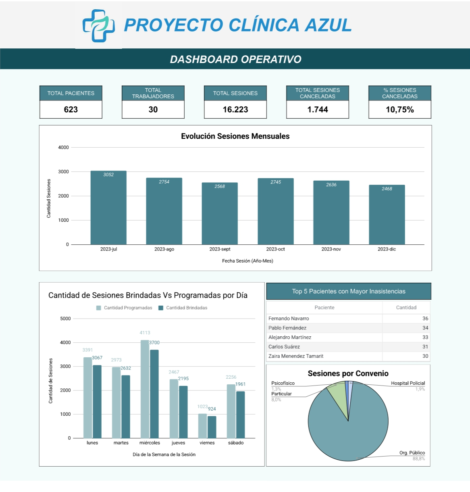
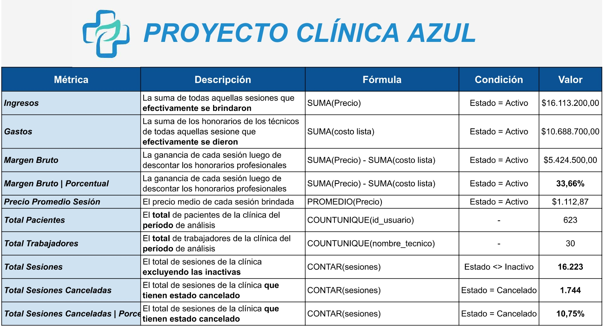

# 🏥 Dashboard Financiero y Operativo – Clínica Azul

---

## 💡 Problema que resuelve

Clínica Azul contaba con información dispersa y sin estructura analítica, lo que dificultaba interpretar indicadores clave como ingresos por tratamiento, productividad de profesionales y evolución mensual del negocio.

Este dashboard unificó y automatizó esos datos, permitiendo detectar, por ejemplo, que el **10,75% de las sesiones son canceladas** y que la **Fonoaudiología concentra el 34,6% de los ingresos totales**, información crítica para decisiones estratégicas.

---

## 🏢 Contexto del negocio

Clínica Azul es una clínica de servicios integrales de salud con atención en Fonoaudiología, Psicomotricidad, Psicología, Psicopedagogía y otras especialidades. Sus ingresos provienen principalmente de convenios con organismos públicos (88,8%) y en menor medida de pacientes particulares (8%) y otros convenios.

---

## 🎯 Objetivo

Aportar claridad y capacidad analítica al equipo directivo mediante tableros actualizables enfocados en métricas clave de gestión financiera y operativa.

---

## 📊 Vista del dashboard

### Dashboard Financiero

### Dashboard Operativo

### Documentación de KPIs

---

## 📋 Componentes del proyecto

| Componente | Descripción |
|---|---|
| **Dashboard financiero** | Ingresos, gastos, margen bruto y evolución mensual con filtros interactivos |
| **Dashboard operativo** | Sesiones por profesional, inasistencias, ocupación por día y distribución por convenio |
| **Documentación de KPIs** | Hoja con fórmulas, condiciones y definiciones para garantizar trazabilidad |
| **Informe analítico ejecutivo** | Análisis descriptivo, diagnóstico y prescriptivo del desempeño de la clínica |

---

## ✅ Resultados clave

| Métrica | Valor |
|---|---|
| Ingresos totales | $16.113.200 |
| Gastos (honorarios) | $10.688.700 |
| Margen bruto | $5.424.500 **(33,66%)** |
| Precio medio por sesión | $1.113 |
| Total pacientes únicos | 623 |
| Total trabajadores | 30 |
| Total sesiones analizadas | 16.223 |
| Sesiones canceladas | 1.744 **(10,75%)** |

**Servicio más rentable:** Psicofísico con 56,25% de margen bruto  
**Servicio de mayor ingreso:** Fonoaudiología con $5.575.700  
**Día de mayor actividad:** Miércoles (4.113 sesiones programadas)  
**Top paciente con más inasistencias:** Fernando Navarro (36 ausencias)

---

## ⚙️ Tecnología utilizada

- **Google Sheets** — organización del dataset, tablas dinámicas y visualizaciones dinámicas
- **Fórmulas aplicadas:** `SUMA`, `PROMEDIO`, `COUNTUNIQUE`, `CONTAR`, filtros por condición de estado

---

## 🔗 Acceso al proyecto

👉 [Ver dashboard interactivo en Google Sheets](https://docs.google.com/spreadsheets/d/1kYPVY3GiMOG6yp2Y-l5Thbo9csCi3hhINz9rKHpd6fg/edit?usp=sharing)

---

## 👩‍💻 Autora

**María Sofía Nolazco** — Ingeniera Civil | Analista de Datos  
[LinkedIn](https://www.linkedin.com/in/maria-sofia-nolazco-4a69a0134) · [Portfolio](https://sofianolazco.github.io/)
